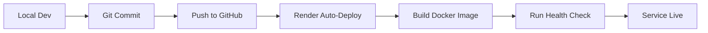

# 🚀 AI Content Agent - Render Deployment Guide

This guide will walk you through deploying the AI Content Agent on Render.com, a modern cloud platform with automatic deployments from Git.

## 📋 Prerequisites

Before deploying, ensure you have:

1. **Render Account**: Sign up at [render.com](https://render.com) (free tier available)
2. **GitHub/GitLab Account**: Your code must be in a Git repository
3. **OpenAI API Key**: Required for content generation
4. **Google Sheets Credentials** (Optional): For topics fallback
   - `client_secret.json`
   - `token.pickle`

## 🎯 Deployment Options

### Option 1: Docker Deployment (Recommended)
Use the existing `Dockerfile` to deploy both frontend and backend together.

**Pros:**
- Single service to manage
- Simpler configuration
- Consistent with existing setup
- Uses existing Dockerfile

**Cons:**
- Frontend served from Flask (not CDN)
- Single point of failure

### Option 2: Separate Services
Deploy backend as Web Service and frontend as Static Site.

**Pros:**
- Frontend served from CDN (faster)
- Independent scaling
- Better separation of concerns

**Cons:**
- More complex CORS configuration
- Two services to manage

---

## 🚀 Option 1: Docker Deployment (Recommended)

### Step 1: Push Your Code to GitHub

```bash
# Initialize git if not already done
git init

# Add all files
git add .

# Commit changes
git commit -m "Prepare for Render deployment"

# Add remote repository (create one on GitHub first)
git remote add origin https://github.com/YOUR_USERNAME/ai-content-agent.git

# Push to GitHub
git push -u origin main
```

### Step 2: Connect Render to GitHub

1. Go to [Render Dashboard](https://dashboard.render.com/)
2. Click **"New +"** → **"Web Service"**
3. Connect your GitHub account if not already connected
4. Select the `ai-content-agent` repository

### Step 3: Configure the Web Service

Fill in the following details:

- **Name**: `ai-content-agent`
- **Region**: Choose closest to your users (e.g., Oregon, Frankfurt)
- **Branch**: `main`
- **Runtime**: **Docker**
- **Dockerfile Path**: `./Dockerfile`
- **Docker Build Context**: `.`
- **Plan**: Start with **Starter** ($7/month) or **Free** (sleeps after inactivity)

### Step 4: Set Environment Variables

In the Render dashboard, add these environment variables:

| Variable Name | Value | Notes |
|---------------|-------|-------|
| `PORT` | `5050` | Render sets this automatically, but we use 5050 |
| `FLASK_ENV` | `production` | Production mode |
| `OPENAI_API_KEY` | `sk-...` | Your OpenAI API key (required) |
| `USE_JSON_LIBRARY` | `true` | Enable JSON-based prompt library |
| `FALLBACK_TO_SHEETS` | `true` | Enable Google Sheets fallback |
| `PYTHON_VERSION` | `3.11.0` | Python version (optional) |

**Important:** Mark `OPENAI_API_KEY` as secret by checking the "Secret" checkbox.

### Step 5: Add Google Sheets Credentials (Optional)

If you're using Google Sheets integration:

1. In Render dashboard, go to your service → **"Environment"** tab
2. Click **"Add Secret Files"**
3. Add two files:
   - **Filename**: `client_secret.json`
   - **Contents**: Paste your Google OAuth client secret JSON
   - **Filename**: `token.pickle`
   - **Contents**: Upload your token.pickle file (base64 encoded if needed)

Alternatively, disable Google Sheets by setting:
```
FALLBACK_TO_SHEETS=false
```

### Step 6: Deploy

1. Click **"Create Web Service"**
2. Render will automatically:
   - Clone your repository
   - Build the Docker image
   - Deploy the service
   - Assign a public URL (e.g., `https://ai-content-agent.onrender.com`)

### Step 7: Verify Deployment

Once deployed, test your endpoints:

```bash
# Health check
curl https://ai-content-agent.onrender.com/api/health

# System info
curl https://ai-content-agent.onrender.com/api/system-info

# Access frontend
# Open in browser: https://ai-content-agent.onrender.com/
```

### Step 8: Update CORS Settings

Update `app.py` to allow your Render URL:

```python
allowed_origins = [
    'http://localhost:3000',
    'http://localhost:3001',
    'https://ai-content-agent.onrender.com',  # Add your Render URL
]
```

Commit and push the changes - Render will auto-deploy.

---

## 🎨 Option 2: Separate Services Deployment

### Backend: Web Service

1. **Create Web Service**
   - Go to Render Dashboard → **"New +"** → **"Web Service"**
   - Connect your repository
   - **Build Command**: `pip install -r requirements.txt`
   - **Start Command**: `python app.py`
   - **Environment**: `Python 3`

2. **Environment Variables** (same as Option 1)

### Frontend: Static Site

1. **Create Static Site**
   - Go to Render Dashboard → **"New +"** → **"Static Site"**
   - Connect your repository
   - **Root Directory**: `ai-content-agent-ui`
   - **Build Command**: `npm install && npm run build`
   - **Publish Directory**: `build`

2. **Update API URL**
   - Create `.env.production` in `ai-content-agent-ui/`:
     ```
     REACT_APP_API_URL=https://ai-content-agent-backend.onrender.com
     ```

3. **Update Backend CORS**
   - Add static site URL to `allowed_origins` in `app.py`

---

## 🔧 Configuration Files

### render.yaml (Infrastructure as Code)

A `render.yaml` file has been created in your project root. To use it:

1. Push the file to your repository
2. Go to Render Dashboard → **"New +"** → **"Blueprint"**
3. Connect your repository
4. Render will automatically create the service defined in `render.yaml`

This approach is great for:
- Version controlling your infrastructure
- Consistent deployments
- Easy replication across environments

---

## 📊 Post-Deployment Configuration

### Custom Domain (Optional)

1. Go to your service → **"Settings"** → **"Custom Domains"**
2. Click **"Add Custom Domain"**
3. Enter your domain (e.g., `ai-content-agent.yourdomain.com`)
4. Update DNS records as instructed by Render

### Automatic Deployments

Render automatically deploys when you push to your main branch:

```bash
git add .
git commit -m "Update features"
git push origin main
# Render auto-deploys in ~2-3 minutes
```

To disable auto-deploy:
1. Go to service → **"Settings"**
2. Toggle **"Auto-Deploy"** off

### Health Checks

Render uses your `/api/health` endpoint to monitor service health:
- Check interval: 30 seconds
- Unhealthy threshold: 3 consecutive failures
- Auto-restart on failure

### Logs and Monitoring

View logs in real-time:
1. Go to your service dashboard
2. Click **"Logs"** tab
3. See live application logs

Or use the CLI:
```bash
# Install Render CLI
npm install -g @render-devtools/cli

# View logs
render logs -s ai-content-agent --tail
```

---

## 🔒 Security Best Practices

1. **API Keys**: Always use environment variables, never commit keys to Git
2. **Secrets**: Mark sensitive variables as "Secret" in Render
3. **CORS**: Only allow specific origins, not `*`
4. **HTTPS**: Render provides free SSL certificates automatically
5. **Validation**: Keep input validation and rate limiting enabled

---

## 💰 Pricing

### Free Plan
- Sleeps after 15 minutes of inactivity
- 750 hours/month free
- Perfect for testing
- **Limitations**: Cold starts (15-30 seconds)

### Starter Plan ($7/month)
- Always on (no sleeping)
- 512 MB RAM
- Shared CPU
- Recommended for production

### Standard Plan ($25/month)
- 2 GB RAM
- Dedicated CPU
- Better for high traffic

---

## 🐛 Troubleshooting

### Issue: Service Fails to Start

**Check logs:**
```bash
# In Render dashboard → Logs tab
```

**Common causes:**
- Missing environment variables (especially `OPENAI_API_KEY`)
- Port mismatch (ensure Flask uses `PORT` env var)
- Dependency installation failures

**Solution:**
```python
# In app.py, ensure:
port = int(os.environ.get('PORT', 5050))
app.run(host='0.0.0.0', port=port)
```

### Issue: CORS Errors

**Symptoms:**
- Frontend can't reach backend
- "CORS policy" errors in browser console

**Solution:**
```python
# Add your Render URL to allowed_origins in app.py
allowed_origins = [
    'https://ai-content-agent.onrender.com',
    # ... other origins
]
```

### Issue: Build Fails

**Docker build errors:**
- Check Dockerfile syntax
- Ensure all files are committed to Git
- Verify `requirements.txt` is correct

**Solution:**
```bash
# Test Docker build locally
docker build -t ai-content-agent .
docker run -p 5050:5050 ai-content-agent
```

### Issue: Slow Response Times

**Cause:** Free tier services sleep after inactivity

**Solutions:**
1. Upgrade to Starter plan ($7/month)
2. Use a cron job to ping the service every 14 minutes:
   - Go to Render Dashboard → **"New +"** → **"Cron Job"**
   - Command: `curl https://ai-content-agent.onrender.com/api/health`
   - Schedule: `*/14 * * * *` (every 14 minutes)

### Issue: Google Sheets Authentication Fails

**Solution:**
1. Disable Google Sheets: Set `FALLBACK_TO_SHEETS=false`
2. Or upload credentials as secret files (see Step 5)

---

## 🔄 CI/CD Workflow

Your deployment workflow will be:



---

## 📈 Monitoring and Scaling

### Metrics Available

In Render Dashboard:
- CPU usage
- Memory usage
- Response times
- Request counts
- Error rates

### Scaling Options

1. **Vertical Scaling**: Upgrade to larger plan
2. **Horizontal Scaling**: Add multiple instances (Standard+ plans)
3. **Auto-Scaling**: Configure in service settings

---

## 📝 Deployment Checklist

Before going live, verify:

- [ ] Code pushed to GitHub/GitLab
- [ ] `render.yaml` configured (optional)
- [ ] Environment variables set in Render dashboard
- [ ] `OPENAI_API_KEY` added and marked as secret
- [ ] Google Sheets credentials uploaded (if needed)
- [ ] CORS configured with Render URL
- [ ] Health check endpoint working
- [ ] Frontend can connect to backend
- [ ] Test content generation works
- [ ] Custom domain configured (optional)
- [ ] Monitoring/alerts set up
- [ ] Backup strategy in place

---

## 🆘 Getting Help

### Render Support
- [Render Documentation](https://render.com/docs)
- [Community Forum](https://community.render.com)
- [Discord](https://discord.gg/render)

### Project-Specific Issues
- Check Flask logs: Render Dashboard → Logs
- Test locally: `docker build -t test . && docker run -p 5050:5050 test`
- Health check: `curl https://YOUR_URL.onrender.com/api/health`

---

## 🎉 Success!

Once deployed, your AI Content Agent will be accessible at:
- **Production URL**: `https://ai-content-agent.onrender.com`
- **API Health**: `https://ai-content-agent.onrender.com/api/health`
- **System Info**: `https://ai-content-agent.onrender.com/api/system-info`

**Next Steps:**
1. Share the URL with your team
2. Set up monitoring and alerts
3. Configure custom domain (optional)
4. Implement rate limiting for API endpoints
5. Set up backups for generated content

---

**Deployment Guide Version:** 1.0  
**Last Updated:** November 2025  
**Platform:** Render.com  
**Estimated Deployment Time:** 10-15 minutes

